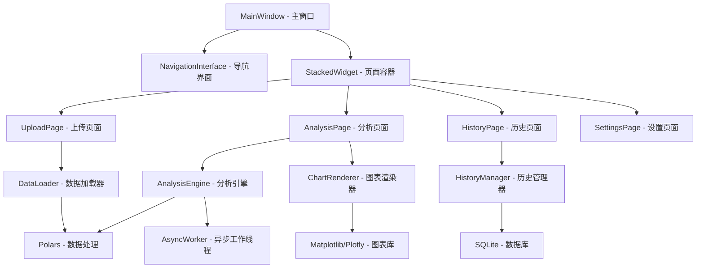

# 设计文档

## 概览

本项目是一个基于PyQt6和PyQt-Fluent-Widgets的现代化数据分析桌面应用程序。系统采用异步架构设计，使用Polars进行高性能数据处理，支持CSV和Parquet格式的数据文件分析。应用程序提供直观的Fluent Design界面，包含数据上传、自动分析、可视化展示和历史记录管理等功能。

## 系统架构

### 主要架构模式



### 分层架构

1. **表现层 (Presentation Layer)**
   - PyQt6窗口和控件
   - PyQt-Fluent-Widgets UI组件
   - 事件处理和用户交互

2. **业务逻辑层 (Business Logic Layer)**
   - 数据分析算法
   - 异步任务管理
   - 文件处理逻辑

3. **数据访问层 (Data Access Layer)**
   - Polars数据处理
   - SQLite历史记录存储
   - 文件系统操作

4. **基础设施层 (Infrastructure Layer)**
   - 异步任务调度
   - 配置管理
   - 日志系统

## 组件和接口

### 1. 主窗口系统

#### MainWindow
```python
class MainWindow(QMainWindow):
    """主应用窗口，使用Fluent Design"""
    def __init__(self):
        self.setup_navigation()
        self.setup_pages()
        self.setup_theme()
    
    def setup_navigation(self):
        """设置NavigationInterface导航栏"""
        
    def setup_pages(self):
        """设置页面堆栈"""
        
    def setup_theme(self):
        """设置Fluent Design主题"""
```

#### NavigationInterface
- 基于PyQt-Fluent-Widgets的NavigationInterface
- 支持自定义图标和主题
- 提供页面间流畅切换

### 2. 数据处理模块

#### DataLoader
```python
class DataLoader:
    """异步数据加载器"""
    async def load_csv(self, file_path: str) -> pl.DataFrame:
        """使用Polars异步加载CSV文件"""
        
    async def load_parquet(self, file_path: str) -> pl.DataFrame:
        """使用Polars异步加载Parquet文件"""
        
    def detect_time_columns(self, df: pl.DataFrame) -> List[str]:
        """检测时间列(DateTime/tagTime)"""
        
    def validate_file_format(self, file_path: str) -> bool:
        """验证文件格式"""
```

#### AnalysisEngine
```python
class AnalysisEngine:
    """数据分析引擎"""
    async def generate_descriptive_stats(self, df: pl.DataFrame) -> Dict:
        """生成描述性统计"""
        
    async def calculate_correlation_matrix(self, df: pl.DataFrame) -> pl.DataFrame:
        """计算关联矩阵"""
        
    async def detect_outliers(self, df: pl.DataFrame) -> Dict:
        """检测异常值"""
        
    async def test_stationarity(self, df: pl.DataFrame) -> Dict:
        """平稳性检验"""
```

### 3. 可视化模块

#### ChartRenderer
```python
class ChartRenderer:
    """图表渲染器"""
    def create_correlation_heatmap(self, corr_matrix: pl.DataFrame) -> Figure:
        """创建关联热力图"""
        
    def create_line_plots(self, df: pl.DataFrame) -> List[Figure]:
        """创建曲线图"""
        
    def create_box_plots(self, df: pl.DataFrame) -> List[Figure]:
        """创建箱线图"""
        
    def create_histograms(self, df: pl.DataFrame) -> List[Figure]:
        """创建分布直方图"""
        
    def apply_nature_style(self, fig: Figure) -> Figure:
        """应用nature风格样式"""
```

### 4. 历史记录管理界面

#### HistoryPage
```python
class HistoryPage(QWidget):
    """历史记录页面 - 管理和查看分析历史"""
    
    def __init__(self, parent=None):
        super().__init__(parent)
        self.history_manager = HistoryManager()
        self.setup_ui()
        self.load_history_data()
    
    def setup_ui(self):
        """设置UI布局"""
        # 搜索栏
        self.search_bar = SearchLineEdit()
        self.search_bar.setPlaceholderText("搜索文件名...")
        
        # 工具栏
        self.toolbar = CommandBar()
        self.refresh_action = Action("刷新", self)
        self.delete_action = Action("删除选中", self)
        self.clear_all_action = Action("清空历史", self)
        self.export_action = Action("导出", self)
        
        # 历史记录表格
        self.history_table = TableWidget()
        self.setup_table_columns()
        
        # 分页控件
        self.pagination = PaginationWidget()
        
        # 详情面板
        self.detail_panel = AnalysisDetailPanel()
        
        # 统计信息卡片
        self.stats_card = StatsCard()
        
    def setup_table_columns(self):
        """设置表格列"""
        columns = [
            "ID", "文件名", "文件大小", "数据维度", 
            "分析时间", "最近访问", "状态", "操作"
        ]
        self.history_table.setColumnCount(len(columns))
        self.history_table.setHorizontalHeaderLabels(columns)
        
    async def load_history_data(self, page: int = 1, limit: int = 50):
        """异步加载历史数据"""
        offset = (page - 1) * limit
        history_records = await self.history_manager.get_analysis_history(
            limit=limit, offset=offset
        )
        self.populate_table(history_records)
        
    async def search_history(self, keyword: str):
        """搜索历史记录"""
        if keyword.strip():
            records = await self.history_manager.search_history(keyword)
        else:
            records = await self.history_manager.get_analysis_history()
        self.populate_table(records)
        
    async def delete_selected_records(self):
        """删除选中的记录"""
        selected_rows = self.get_selected_rows()
        if not selected_rows:
            return
            
        # 确认对话框
        result = MessageBox.question(
            self, "确认删除", 
            f"确定要删除选中的 {len(selected_rows)} 条记录吗？",
            MessageBox.Yes | MessageBox.No
        )
        
        if result == MessageBox.Yes:
            record_ids = [self.get_record_id(row) for row in selected_rows]
            deleted_count = await self.history_manager.delete_multiple_records(record_ids)
            
            InfoBar.success(
                title="删除成功",
                content=f"已删除 {deleted_count} 条记录",
                parent=self
            )
            await self.load_history_data()
            
    async def clear_all_history(self):
        """清空所有历史记录"""
        result = MessageBox.warning(
            self, "危险操作", 
            "确定要清空所有历史记录吗？此操作不可撤销！",
            MessageBox.Yes | MessageBox.No
        )
        
        if result == MessageBox.Yes:
            success = await self.history_manager.clear_all_history()
            if success:
                InfoBar.success(
                    title="清空成功",
                    content="所有历史记录已清空",
                    parent=self
                )
                await self.load_history_data()
```

#### DatabaseInterface
```python
class DatabaseInterface:
    """数据库接口类 - 提供统一的数据库操作接口"""
    
    def __init__(self, db_path: str):
        self.db_path = db_path
        self.connection_pool = aiosqlite.connect(db_path)
        
    async def execute_query(self, query: str, params: tuple = ()) -> List[Dict]:
        """执行查询并返回结果"""
        
    async def execute_non_query(self, query: str, params: tuple = ()) -> int:
        """执行非查询操作（INSERT, UPDATE, DELETE）"""
        
    async def execute_batch(self, query: str, params_list: List[tuple]) -> int:
        """批量执行操作"""
        
    async def get_table_info(self, table_name: str) -> Dict:
        """获取表结构信息"""
        
    async def backup_database(self, backup_path: str) -> bool:
        """备份数据库"""
        
    async def restore_database(self, backup_path: str) -> bool:
        """恢复数据库"""
        
    def close(self):
        """关闭数据库连接"""
```

### 5. 历史记录系统

#### HistoryManager
```python
class HistoryManager:
    """SQLite历史记录管理器"""
    def __init__(self, db_path: str = "data/analysis_history.db"):
        """初始化SQLite数据库连接"""
        self.db_path = db_path
        self.init_database()
        
    def init_database(self):
        """初始化数据库表结构"""
        
    async def save_analysis_result(self, file_info: FileInfo, analysis_result: AnalysisResult) -> int:
        """保存完整分析结果到数据库
        
        Returns:
            int: 保存记录的ID
        """
        
    async def get_analysis_history(self, limit: int = 100, offset: int = 0) -> List[Dict]:
        """获取分析历史列表（分页）
        
        Args:
            limit: 每页记录数
            offset: 偏移量
            
        Returns:
            List[Dict]: 历史记录列表
        """
        
    async def search_history(self, keyword: str) -> List[Dict]:
        """根据文件名搜索历史记录
        
        Args:
            keyword: 搜索关键词
            
        Returns:
            List[Dict]: 匹配的历史记录
        """
        
    async def load_analysis_by_id(self, record_id: int) -> Optional[AnalysisResult]:
        """根据记录ID加载完整分析结果
        
        Args:
            record_id: 记录ID
            
        Returns:
            Optional[AnalysisResult]: 分析结果对象
        """
        
    async def load_analysis_by_hash(self, file_hash: str) -> Optional[AnalysisResult]:
        """根据文件哈希值加载分析结果
        
        Args:
            file_hash: 文件哈希值
            
        Returns:
            Optional[AnalysisResult]: 分析结果对象
        """
        
    async def delete_analysis_record(self, record_id: int) -> bool:
        """删除指定的分析记录
        
        Args:
            record_id: 要删除的记录ID
            
        Returns:
            bool: 删除是否成功
        """
        
    async def delete_multiple_records(self, record_ids: List[int]) -> int:
        """批量删除分析记录
        
        Args:
            record_ids: 要删除的记录ID列表
            
        Returns:
            int: 成功删除的记录数
        """
        
    async def clear_all_history(self) -> bool:
        """清空所有历史记录
        
        Returns:
            bool: 清空是否成功
        """
        
    async def get_statistics(self) -> Dict:
        """获取历史记录统计信息
        
        Returns:
            Dict: 包含总记录数、最新记录时间等统计信息
        """
        
    def calculate_file_hash(self, file_path: str) -> str:
        """计算文件SHA256哈希值
        
        Args:
            file_path: 文件路径
            
        Returns:
            str: 文件哈希值
        """
        
    def check_file_exists_in_history(self, file_hash: str) -> bool:
        """检查文件是否已在历史记录中
        
        Args:
            file_hash: 文件哈希值
            
        Returns:
            bool: 文件是否存在于历史记录
        """
        
    async def update_analysis_metadata(self, record_id: int, metadata: Dict) -> bool:
        """更新分析记录的元数据
        
        Args:
            record_id: 记录ID
            metadata: 新的元数据
            
        Returns:
            bool: 更新是否成功
        """
        
    def export_history_to_json(self, output_path: str) -> bool:
        """导出历史记录到JSON文件
        
        Args:
            output_path: 输出文件路径
            
        Returns:
            bool: 导出是否成功
        """
        
    def import_history_from_json(self, input_path: str) -> bool:
        """从JSON文件导入历史记录
        
        Args:
            input_path: 输入文件路径
            
        Returns:
            bool: 导入是否成功
        """
```

### 5. 异步任务管理

#### AsyncWorker
```python
class AsyncWorker(QThread):
    """异步工作线程"""
    progress_updated = pyqtSignal(int)
    analysis_completed = pyqtSignal(dict)
    error_occurred = pyqtSignal(str)
    
    def run(self):
        """执行异步任务"""
```

## 数据模型

### 1. 数据库模式

#### analysis_history表（主表）
```sql
CREATE TABLE analysis_history (
    id INTEGER PRIMARY KEY AUTOINCREMENT,
    file_hash TEXT UNIQUE NOT NULL,
    file_name TEXT NOT NULL,
    file_path TEXT NOT NULL,
    file_size INTEGER NOT NULL,
    analysis_date TIMESTAMP DEFAULT CURRENT_TIMESTAMP,
    last_accessed TIMESTAMP DEFAULT CURRENT_TIMESTAMP,
    data_shape_rows INTEGER,
    data_shape_cols INTEGER,
    time_columns TEXT, -- JSON数组格式存储时间列名
    column_names TEXT NOT NULL, -- JSON数组格式存储所有列名
    descriptive_stats TEXT, -- JSON格式存储描述性统计
    correlation_matrix TEXT, -- JSON格式存储关联矩阵
    outliers_data TEXT, -- JSON格式存储异常值数据
    stationarity_tests TEXT, -- JSON格式存储平稳性检验结果
    charts_config TEXT, -- JSON格式存储图表配置
    analysis_metadata TEXT, -- JSON格式存储分析元数据
    status TEXT DEFAULT 'completed', -- 分析状态: completed, failed, partial
    error_message TEXT, -- 错误信息（如果有）
    created_at TIMESTAMP DEFAULT CURRENT_TIMESTAMP,
    updated_at TIMESTAMP DEFAULT CURRENT_TIMESTAMP
);
```

#### analysis_charts表（图表存储）
```sql
CREATE TABLE analysis_charts (
    id INTEGER PRIMARY KEY AUTOINCREMENT,
    analysis_id INTEGER NOT NULL,
    chart_type TEXT NOT NULL, -- heatmap, line, box, histogram等
    chart_title TEXT NOT NULL,
    chart_data TEXT NOT NULL, -- JSON格式存储图表数据
    chart_config TEXT, -- JSON格式存储图表配置
    file_path TEXT, -- 图表文件保存路径
    created_at TIMESTAMP DEFAULT CURRENT_TIMESTAMP,
    FOREIGN KEY (analysis_id) REFERENCES analysis_history(id) ON DELETE CASCADE
);
```

#### user_settings表（用户设置）
```sql
CREATE TABLE user_settings (
    id INTEGER PRIMARY KEY AUTOINCREMENT,
    setting_key TEXT UNIQUE NOT NULL,
    setting_value TEXT NOT NULL,
    setting_type TEXT DEFAULT 'string', -- string, int, bool, json
    description TEXT,
    created_at TIMESTAMP DEFAULT CURRENT_TIMESTAMP,
    updated_at TIMESTAMP DEFAULT CURRENT_TIMESTAMP
);
```

#### app_logs表（应用日志）
```sql
CREATE TABLE app_logs (
    id INTEGER PRIMARY KEY AUTOINCREMENT,
    log_level TEXT NOT NULL, -- DEBUG, INFO, WARNING, ERROR, CRITICAL
    message TEXT NOT NULL,
    module_name TEXT,
    function_name TEXT,
    line_number INTEGER,
    timestamp TIMESTAMP DEFAULT CURRENT_TIMESTAMP,
    extra_data TEXT -- JSON格式存储额外数据
);
```

#### 索引设计
```sql
-- 主要查询索引
CREATE INDEX idx_file_hash ON analysis_history(file_hash);
CREATE INDEX idx_analysis_date ON analysis_history(analysis_date DESC);
CREATE INDEX idx_file_name ON analysis_history(file_name);
CREATE INDEX idx_last_accessed ON analysis_history(last_accessed DESC);
CREATE INDEX idx_status ON analysis_history(status);

-- 图表查询索引
CREATE INDEX idx_charts_analysis_id ON analysis_charts(analysis_id);
CREATE INDEX idx_charts_type ON analysis_charts(chart_type);

-- 设置查询索引
CREATE INDEX idx_settings_key ON user_settings(setting_key);

-- 日志查询索引
CREATE INDEX idx_logs_timestamp ON app_logs(timestamp DESC);
CREATE INDEX idx_logs_level ON app_logs(log_level);

-- 复合索引
CREATE INDEX idx_analysis_date_status ON analysis_history(analysis_date DESC, status);
```

#### 数据库触发器
```sql
-- 自动更新updated_at字段
CREATE TRIGGER update_analysis_history_updated_at 
    AFTER UPDATE ON analysis_history
    FOR EACH ROW
BEGIN
    UPDATE analysis_history 
    SET updated_at = CURRENT_TIMESTAMP 
    WHERE id = NEW.id;
END;

CREATE TRIGGER update_user_settings_updated_at 
    AFTER UPDATE ON user_settings
    FOR EACH ROW
BEGIN
    UPDATE user_settings 
    SET updated_at = CURRENT_TIMESTAMP 
    WHERE id = NEW.id;
END;

-- 自动更新last_accessed字段
CREATE TRIGGER update_last_accessed 
    AFTER SELECT ON analysis_history
    FOR EACH ROW
BEGIN
    UPDATE analysis_history 
    SET last_accessed = CURRENT_TIMESTAMP 
    WHERE id = NEW.id;
END;
```

#### 数据库视图
```sql
-- 分析历史摘要视图
CREATE VIEW analysis_summary AS
SELECT 
    id,
    file_name,
    file_hash,
    file_size,
    data_shape_rows,
    data_shape_cols,
    analysis_date,
    last_accessed,
    status,
    CASE 
        WHEN status = 'completed' THEN '✅ 完成'
        WHEN status = 'failed' THEN '❌ 失败'
        WHEN status = 'partial' THEN '⚠️ 部分完成'
        ELSE status
    END as status_display
FROM analysis_history
ORDER BY analysis_date DESC;

-- 图表统计视图
CREATE VIEW chart_statistics AS
SELECT 
    analysis_id,
    COUNT(*) as total_charts,
    GROUP_CONCAT(DISTINCT chart_type) as chart_types
FROM analysis_charts
GROUP BY analysis_id;
```

### 2. 内存数据结构

#### AnalysisResult
```python
@dataclass
class AnalysisResult:
    """分析结果数据类"""
    file_info: FileInfo
    descriptive_stats: Dict[str, Any]
    correlation_matrix: pl.DataFrame
    outliers: Dict[str, List]
    charts: Dict[str, Any]
    stationarity_tests: Dict[str, Any]
    analysis_timestamp: datetime
```

#### FileInfo
```python
@dataclass
class FileInfo:
    """文件信息数据类"""
    file_path: str
    file_name: str
    file_hash: str
    file_size: int
    columns: List[str]
    time_columns: List[str]
    data_shape: Tuple[int, int]
```

## 错误处理

### 1. 异常分类

#### 数据相关异常
```python
class DataLoadError(Exception):
    """数据加载异常"""
    
class DataFormatError(Exception):
    """数据格式异常"""
    
class DataAnalysisError(Exception):
    """数据分析异常"""
```

#### UI相关异常
```python
class UIRenderError(Exception):
    """UI渲染异常"""
    
class ChartGenerationError(Exception):
    """图表生成异常"""
```

### 2. 错误处理策略

- **数据加载失败**: 显示用户友好的错误信息，建议检查文件格式
- **内存不足**: 启用Polars流式处理模式
- **分析失败**: 保存部分结果，标记失败的分析项
- **UI冻结**: 使用异步加载和进度指示器
- **历史记录损坏**: 提供数据库修复工具

## 测试策略

### 1. 单元测试

#### 数据处理模块测试
- Polars数据加载功能测试
- 统计分析算法正确性测试
- 异常值检测算法测试
- 文件哈希计算测试

#### UI组件测试
- 页面导航功能测试
- 用户交互响应测试
- 主题切换测试

### 2. 集成测试

#### 端到端工作流测试
- 完整的数据分析流程测试
- 历史记录保存和加载测试
- 多文件格式兼容性测试

#### 性能测试
- 大文件处理性能测试
- 内存使用效率测试
- UI响应时间测试

### 3. 用户验收测试

#### 功能验收测试
- 核心功能完整性验证
- 用户界面易用性测试
- 分析结果准确性验证

## 技术实现细节

### 1. 异步架构实现

#### 使用QThread进行异步处理
```python
class DataAnalysisWorker(QThread):
    def __init__(self, data_path, analysis_config):
        super().__init__()
        self.data_path = data_path
        self.analysis_config = analysis_config
    
    def run(self):
        try:
            # 使用Polars进行数据处理
            df = pl.scan_csv(self.data_path).collect(streaming=True)
            # 执行分析...
        except Exception as e:
            self.error_occurred.emit(str(e))
```

#### 进度反馈机制
- 使用QProgressBar显示任务进度
- 通过信号槽机制更新UI状态
- 支持任务取消功能

### 2. Polars优化配置

#### 流式处理配置
```python
# 大文件使用流式处理
df = pl.scan_csv(file_path).collect(streaming=True)

# 延迟计算优化
lazy_df = pl.scan_csv(file_path)\
    .filter(pl.col("column").is_not_null())\
    .select(["col1", "col2", "col3"])\
    .collect()
```

#### 内存管理
- 自动检测可用内存
- 根据数据大小选择处理策略
- 实现数据分块处理

### 3. PyQt-Fluent-Widgets集成

#### 主题配置
```python
from qfluentwidgets import setTheme, Theme, setThemeColor

class ThemeManager:
    def __init__(self):
        self.setup_theme()
    
    def setup_theme(self):
        # 设置主题色
        setThemeColor('#0078d4')
        # 设置暗色/亮色主题
        setTheme(Theme.AUTO)
```

#### 自定义组件
```python
class DataPreviewCard(ElevatedCardWidget):
    """数据预览卡片组件"""
    def __init__(self, parent=None):
        super().__init__(parent)
        self.setup_ui()
    
    def setup_ui(self):
        # 使用Fluent Design组件构建UI
        pass
```

### 4. 图表样式配置

#### Matplotlib Nature风格
```python
def setup_nature_style():
    """配置Nature期刊风格"""
    plt.style.use('seaborn-v0_8-whitegrid')
    plt.rcParams.update({
        'font.family': 'Arial',
        'font.size': 12,
        'axes.linewidth': 1.5,
        'axes.spines.top': False,
        'axes.spines.right': False,
    })
```

#### Plotly配置
```python
def get_plotly_template():
    """获取Plotly模板配置"""
    return {
        'layout': {
            'font': {'family': 'Arial', 'size': 12},
            'colorway': ['#1f77b4', '#ff7f0e', '#2ca02c'],
            'plot_bgcolor': 'white',
            'paper_bgcolor': 'white'
        }
    }
```

### 5. 项目结构

```
data_analysis_app/
├── main.py                 # 应用程序入口
├── pyproject.toml          # 项目配置文件
├── requirements.txt        # 依赖列表
├── src/
│   ├── __init__.py
│   ├── ui/                 # UI模块
│   │   ├── __init__.py
│   │   ├── main_window.py  # 主窗口
│   │   ├── pages/          # 页面组件
│   │   │   ├── upload_page.py
│   │   │   ├── analysis_page.py
│   │   │   ├── history_page.py
│   │   │   └── settings_page.py
│   │   └── components/     # 自定义组件
│   ├── core/              # 核心业务逻辑
│   │   ├── __init__.py
│   │   ├── data_loader.py
│   │   ├── analysis_engine.py
│   │   ├── chart_renderer.py
│   │   └── history_manager.py
│   ├── models/            # 数据模型
│   │   ├── __init__.py
│   │   └── data_models.py
│   └── utils/             # 工具函数
│       ├── __init__.py
│       ├── async_utils.py
│       ├── file_utils.py
│       └── theme_utils.py
├── resources/             # 资源文件
│   ├── icons/             # 图标文件
│   ├── styles/            # 样式文件
│   └── config/            # 配置文件
├── data/                  # 数据目录
│   └── history.db         # 历史记录数据库
└── tests/                 # 测试文件
    ├── test_data_loader.py
    ├── test_analysis_engine.py
    └── test_ui_components.py
```

### 6. 性能优化策略

#### 数据处理优化
- 使用Polars的lazy API进行查询优化
- 实现数据分页加载机制
- 采用内存映射文件读取

#### UI渲染优化
- 使用虚拟化列表显示大量数据
- 实现图表的延迟加载
- 优化绘制频率和重绘区域

#### 内存管理
- 实现数据缓存策略
- 及时释放不需要的对象
- 监控内存使用情况